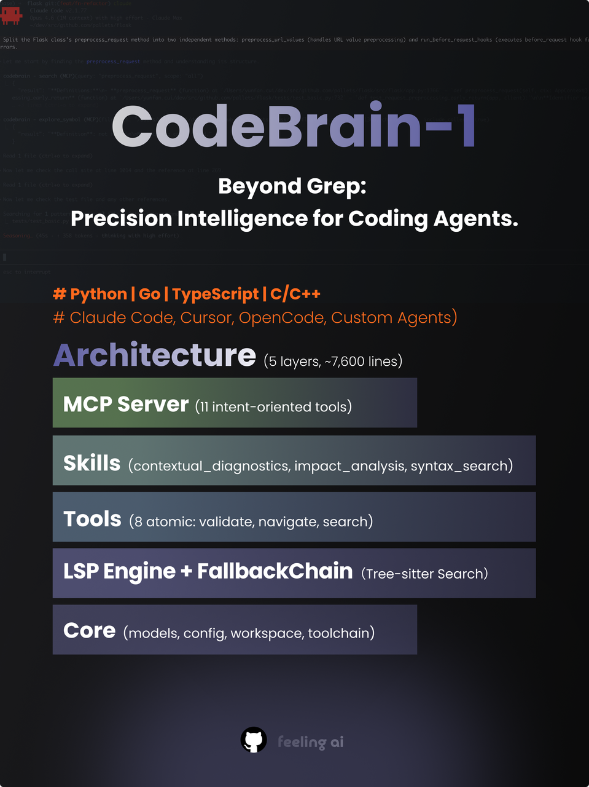
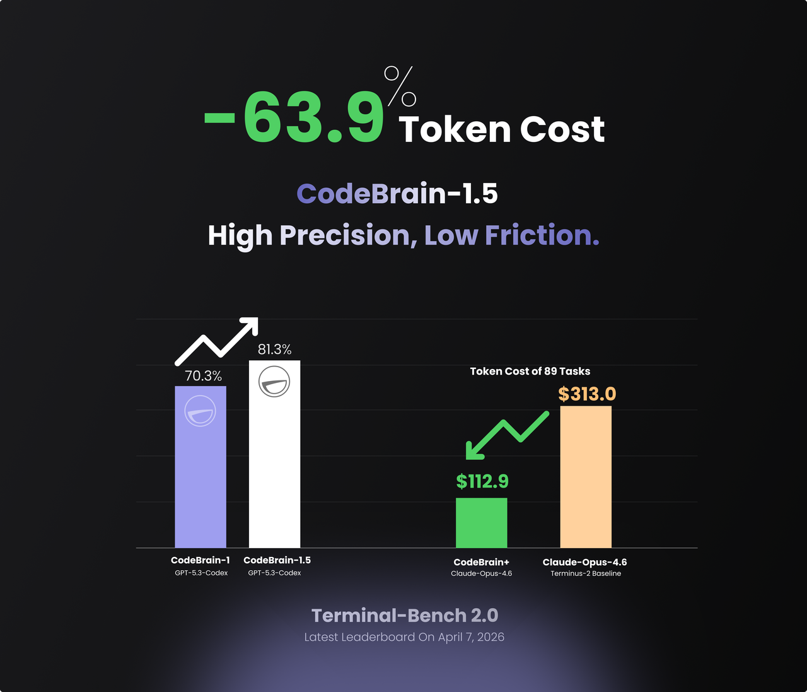

# CodeBrain-1

A code-based "brain" that dynamically adjusts plans and strategies through code generation.



## Benchmark Results

CodeBrain-1 achieves top-tier performance on [Terminal Bench 2.0](https://www.tbench.ai/) by 2026-02-10:



On a focused subset of 47 coding tasks, CodeBrain-1 scores **72.3%**, demonstrating consistent code generation and execution capabilities.

Terminal Bench 2.0 is one of the harder agent benchmarks out there. It throws long, multi-step terminal tasks at you where things break in messy, realistic ways. Running it surfaced a bunch of recurring failure modes in our pipeline, and most of our gains came from just fixing those:

Premature stop recovery was a big one. Sometimes the agent emits a message instead of a tool call, and the harness interprets that as "I'm done." It's not. We added a check for unverified stops that sends a continuation prompt to get it back on track.

We also built structured tools for workspace analysis and constraint checking - inspecting file layout and resource state upfront instead of letting the agent poke around ad-hoc. Cuts down on a lot of wasted early turns.

Dynamic reasoning effort: we run high reasoning during planning and verification, medium during implementation. Sounds obvious but it makes a real difference in token spend without hurting quality where it matters.

Tool-call correction - just auto-fixing common formatting errors that would otherwise burn a turn for nothing.

Tighter stuck-detection. We lowered the threshold for catching repeated identical commands. Agents love to get stuck in loops and run out the clock, so this matters more than you'd think.

Context compression: LLM-summarized history with early messages pinned so the agent doesn't lose track of what it was actually asked to do in long sessions. Without this, tasks that go 50+ turns fall apart.

And model-specific prompts - different models have different failure patterns, so we tailored behavioral guidance per model instead of using one prompt for everything.

## Tech Highlights

### Effective Context Searching

CodeBrain utilizes the code and symbol cross-referencing and indexing mechanisms provided by the Language Server Protocol (LSP) to efficiently and accurately retrieve information relevant to coding tasks, thereby enhancing the accuracy of large language models (LLMs) in program synthesis and problem-solving.

### Validation Feedback

CodeBrain further leverages the diagnostic capabilities of the Language Server Protocol (LSP) and, grounded in engineering expertise and task-specific characteristics, performs filtering, aggregation, and contextual information retrieval over LSP diagnostic outputs, thereby significantly reducing the overhead of the code–verify (or code–check) iteration loop.

## Key design decisions

- **Multi-language** — Python, Go, TypeScript/JavaScript, and C/C++ through one unified interface
- **Graceful degradation** — `FallbackChain` auto-switches from LSP to CLI tools such as `pyright`, `go vet`, and `tsc` when language servers are unavailable
- **Monorepo-aware** — auto-discovers sub-projects and resolves per-project toolchains such as `venv`, `go.mod`, `tsconfig`, and `CMake`
- **Zero framework coupling** — pure Python, works with any MCP-compatible agent
- **Intent-oriented tools** — consolidated low-level operations into what agents actually need, such as `validate`, `explore_symbol`, `search`, `check_impact`, `debug_trace`, and `rename_symbol`

## What CodeBrain enables for agents

### Quickly grasp project structure

`outline` and `list_subprojects` let agents map a codebase's file hierarchy, symbol tree, and sub-project boundaries with far fewer exploratory file reads.

### Reduce code search cost

Structural search through `search` finds symbols by syntactic role rather than simple string matching, helping agents reach relevant code faster with less noise.

### Tighten the edit-validate loop

`validate` provides compiler-grade diagnostics immediately after edits, helping agents catch type errors, missing imports, and signature mismatches without running a full build every time.

### Make refactors safer

`check_impact`, `explore_symbol`, and `rename_symbol` surface callers, usages, and downstream breakage before agents commit to broader code changes.

### Accelerate debugging

`debug_trace` enriches stack traces with code intelligence and context, helping agents identify likely root causes faster.

### Work reliably across environments

Through graceful degradation, agents can still obtain useful diagnostics when full LSP support is unavailable, while `check_health` reports current capability and degraded states.

### Handle monorepos natively

CodeBrain detects sub-project boundaries and resolves the corresponding toolchains automatically, so agents do not need to know the repository layout in advance.

## Current language support maturity

| Language | Status |
|----------|--------|
| Python | Production-ready |
| Go | LSP-complete + CLI fallback |
| TypeScript / JavaScript | Functional + CLI fallback |
| C / C++ | Basic LSP |

## Use Case: Runtime Code Generation for Gameplay

### An Example

In search–engage–withdraw–style games, if a player repeatedly follows a habitual route and is observed multiple times, opposing groups can gradually reinforce a form of collective memory associated with that behavior.

On map construction phases, the system adjusts its global strategy accordingly by generating related code using CodeBrain. For example, the resources may be allocated as follows:

```
distribute(
  area = calculate_area(spots=player.history_hotspots),
  count = 0.7 * total,
)
```

## Install as MCP Plugin

CodeBrain exposes 11 tools (validate, outline, search, explore_symbol, check_impact, debug_trace, rename_symbol, add_workspace, list_workspaces, check_health, list_subprojects) via the [Model Context Protocol](https://modelcontextprotocol.io/). Any MCP-compatible agent can use them.

### Step 1: Install CodeBrain

```bash
pip install "codebrain[all] @ git+https://github.com/feelingai-team/CodeBrain.git"
```

This installs the `codebrain-mcp` command. Verify with:

```bash
codebrain-mcp --help
```

> **For contributors** — clone and install in editable mode instead:
> ```bash
> git clone https://github.com/feelingai-team/CodeBrain.git
> cd CodeBrain
> pip install -e ".[all]"
> ```

### Step 2: Register with Your Agent

#### Claude Code

**Global** — available in every session:

```bash
claude mcp add --transport stdio codebrain -- codebrain-mcp
```

**Project-scoped** — add `.mcp.json` to your project root (shared with your team via git):

```json
{
  "mcpServers": {
    "codebrain": {
      "type": "stdio",
      "command": "codebrain-mcp",
      "args": []
    }
  }
}
```

Claude Code starts the MCP server in your project's working directory, so CodeBrain automatically targets the right codebase — no `--workspace` flag needed.

**Verify** — start a new Claude Code session and run `/mcp`. You should see `codebrain` listed with 11 tools.

#### OpenCode

**CLI:**

```bash
opencode mcp add codebrain --type local --command "codebrain-mcp"
```

**Config file** — add to `opencode.json` (project root or `~/.config/opencode/opencode.json`):

```json
{
  "$schema": "https://opencode.ai/config.json",
  "mcp": {
    "codebrain": {
      "type": "local",
      "command": ["codebrain-mcp"],
      "enabled": true
    }
  }
}
```

#### Other MCP Clients

```bash
codebrain-mcp --workspace /path/to/project
```

The server communicates over stdio using the MCP JSON-RPC protocol. Point any MCP client at this command.

| Flag | Description |
|------|-------------|
| `--workspace <path>` | Project root (default: current directory) |
| `--languages <lang ...>` | Limit to specific language servers (e.g. `python typescript cpp`) |

See [docs/guide.md](docs/guide.md) for the full reference, including SDK usage, CLAUDE.md integration, and all available tools.

## Open Source Roadmap

We are currently focused on improving stability and efficiency. The planned release stages are:

- [x] **Core module source code**
- [ ] **Integration with popular agents** - TBD
